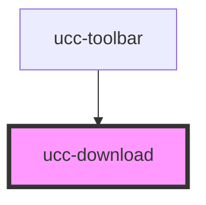

# ucc-download

<!-- Auto Generated Below -->

## Properties

| Property          | Attribute          | Description | Type     | Default     |
| ----------------- | ------------------ | ----------- | -------- | ----------- |
| `ecopy`           | `ecopy`            |             | `string` | `undefined` |
| `itemNumber`      | `item-number`      |             | `string` | `undefined` |
| `items`           | --                 |             | `Item[]` | `undefined` |
| `language`        | `language`         |             | `string` | `undefined` |
| `referenceSystem` | `reference-system` |             | `string` | `undefined` |
| `type`            | `type`             |             | `string` | `undefined` |
| `url`             | `url`              |             | `string` | `undefined` |

## Dependencies

### Used by

 - [ucc-toolbar](../ucc-toolbar)

### Graph

----------------------------------------------

*Built with [StencilJS](https://stenciljs.com/)*
