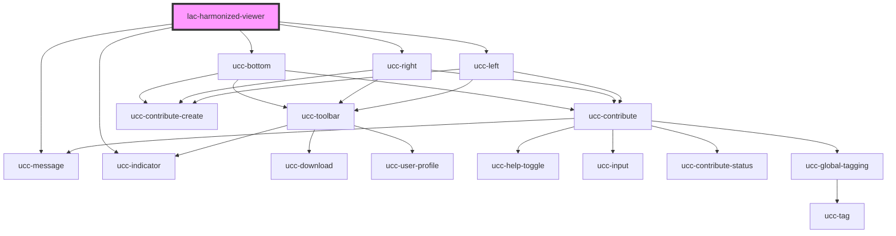

# harmonized-viewer-contribution

<!-- Auto Generated Below -->

## Properties

| Property                 | Attribute                  | Description | Type      | Default     |
| ------------------------ | -------------------------- | ----------- | --------- | ----------- |
| `appEnvironment`         | `app-environment`          |             | `string`  | `undefined` |
| `contributionAlwaysOpen` | `contribution-always-open` |             | `boolean` | `false`     |
| `ecopy`                  | `ecopy`                    |             | `string`  | `undefined` |
| `forceLanguage`          | `language`                 |             | `string`  | `null`      |
| `isUcc`                  | `is-ucc`                   |             | `boolean` | `false`     |
| `itemNumber`             | `item-number`              |             | `string`  | `undefined` |
| `kwicEcopies`            | `kwic-ecopies`             |             | `string`  | `undefined` |
| `kwicPages`              | `kwic-pages`               |             | `string`  | `undefined` |
| `layoutOption`           | `layout-option`            |             | `string`  | `'right'`   |
| `overrideUrl`            | `override-url`             |             | `string`  | `undefined` |
| `referenceSystem`        | `reference-system`         |             | `string`  | `undefined` |
| `showLinkToRecord`       | `show-link-to-record`      |             | `boolean` | `false`     |
| `showUser`               | `show-user`                |             | `boolean` | `false`     |
| `suppressGallery`        | `suppress-gallery`         |             | `boolean` | `false`     |

## Dependencies

### Depends on

- [ucc-message](../ucc-message)
- [ucc-bottom](../ucc)
- [ucc-right](../ucc)
- [ucc-left](../ucc)
- [ucc-indicator](../ucc/ucc-indicator)

### Graph

----------------------------------------------

*Built with [StencilJS](https://stenciljs.com/)*
