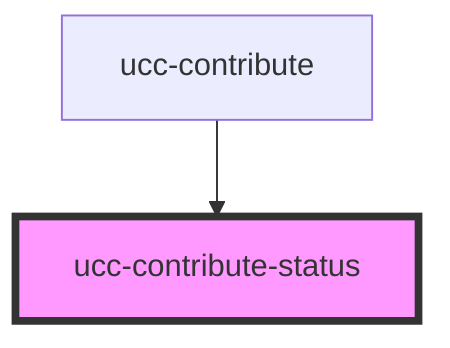

# ucc-contribute-status

<!-- Auto Generated Below -->

## Properties

| Property        | Attribute        | Description | Type      | Default     |
| --------------- | ---------------- | ----------- | --------- | ----------- |
| `editable`      | `editable`       |             | `boolean` | `true`      |
| `name`          | `name`           |             | `string`  | `undefined` |
| `notApplicable` | `not-applicable` |             | `boolean` | `true`      |
| `value`         | `value`          |             | `string`  | `'NS'`      |

## Dependencies

### Used by

 - [ucc-contribute](../ucc-contribute)

### Graph

----------------------------------------------

*Built with [StencilJS](https://stenciljs.com/)*
