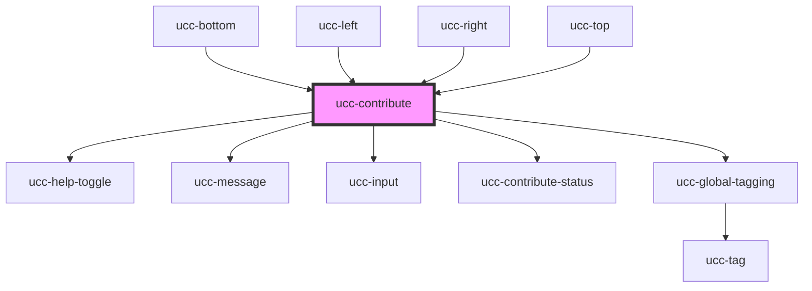

# ucc-contribute

<!-- Auto Generated Below -->

## Properties

| Property          | Attribute          | Description     | Type      | Default     |
| ----------------- | ------------------ | --------------- | --------- | ----------- |
| `isUcc`           | `is-ucc`           |                 | `boolean` | `false`     |
| `itemNumber`      | `item-number`      |                 | `string`  | `undefined` |
| `layoutOption`    | `layout-option`    |                 | `string`  | `'right'`   |
| `referenceSystem` | `reference-system` | STATE VARIABLES | `string`  | `undefined` |

## Events

| Event                              | Description | Type               |
| ---------------------------------- | ----------- | ------------------ |
| `itemUpdated`                      |             | `CustomEvent<any>` |
| `lacModUccContributeTutorialReady` |             | `CustomEvent<any>` |

## Dependencies

### Used by

 - [ucc-bottom](../ucc)
 - [ucc-left](../ucc)
 - [ucc-right](../ucc)
 - [ucc-top](../ucc)

### Depends on

- [ucc-help-toggle](../ucc-help-toggle)
- [ucc-message](../ucc-message)
- [ucc-input](../ucc-input)
- [ucc-contribute-status](../ucc-contribute-status)
- [ucc-global-tagging](../ucc-global-tagging)

### Graph

----------------------------------------------

*Built with [StencilJS](https://stenciljs.com/)*
