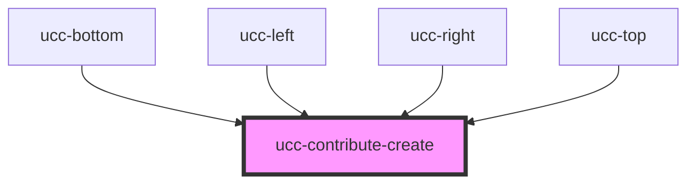

# ucc-contribute-create

<!-- Auto Generated Below -->

## Properties

| Property          | Attribute          | Description | Type     | Default     |
| ----------------- | ------------------ | ----------- | -------- | ----------- |
| `ecopy`           | `ecopy`            |             | `string` | `undefined` |
| `itemNumber`      | `item-number`      |             | `string` | `undefined` |
| `referenceSystem` | `reference-system` |             | `string` | `undefined` |

## Dependencies

### Used by

 - [ucc-bottom](../ucc)
 - [ucc-left](../ucc)
 - [ucc-right](../ucc)
 - [ucc-top](../ucc)

### Graph

----------------------------------------------

*Built with [StencilJS](https://stenciljs.com/)*
