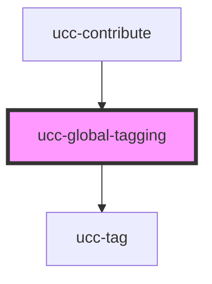

# ucc-global-tagging

<!-- Auto Generated Below -->

## Properties

| Property            | Attribute            | Description | Type          | Default |
| ------------------- | -------------------- | ----------- | ------------- | ------- |
| `autocompleteDelay` | `autocomplete-delay` |             | `number`      | `500`   |
| `value`             | --                   |             | `GlobalTag[]` | `[]`    |

## Methods

### `selectedTags() => Promise<GlobalTag[]>`

#### Returns

Type: `Promise<GlobalTag[]>`

### `setTags(tags: GlobalTag[]) => Promise<any>`

#### Returns

Type: `Promise<any>`

## Dependencies

### Used by

 - [ucc-contribute](../ucc-contribute)

### Depends on

- [ucc-tag](../ucc-tag)

### Graph

----------------------------------------------

*Built with [StencilJS](https://stenciljs.com/)*
