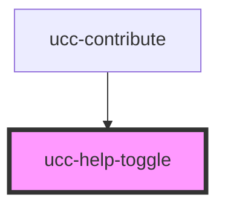

# ucc-help-toggle

<!-- Auto Generated Below -->

## Dependencies

### Used by

 - [ucc-contribute](../ucc-contribute)

### Graph

----------------------------------------------

*Built with [StencilJS](https://stenciljs.com/)*
