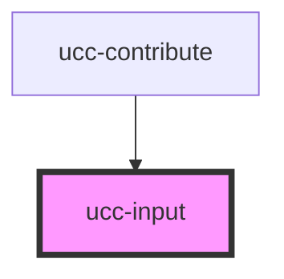

# ucc-input

<!-- Auto Generated Below -->

## Properties

| Property      | Attribute     | Description | Type      | Default     |
| ------------- | ------------- | ----------- | --------- | ----------- |
| `compact`     | `compact`     |             | `boolean` | `undefined` |
| `description` | `description` |             | `string`  | `undefined` |
| `editable`    | `editable`    |             | `boolean` | `true`      |
| `height`      | `height`      |             | `string`  | `undefined` |
| `invalid`     | `invalid`     |             | `boolean` | `undefined` |
| `label`       | `label`       |             | `string`  | `undefined` |
| `multiline`   | `multiline`   |             | `boolean` | `undefined` |
| `name`        | `name`        |             | `string`  | `undefined` |
| `placeholder` | `placeholder` |             | `string`  | `undefined` |
| `required`    | `required`    |             | `boolean` | `false`     |
| `type`        | `type`        |             | `string`  | `undefined` |
| `value`       | `value`       |             | `any`     | `undefined` |
| `vertical`    | `vertical`    |             | `boolean` | `true`      |
| `width`       | `width`       |             | `string`  | `undefined` |

## Dependencies

### Used by

 - [ucc-contribute](../ucc-contribute)

### Graph

----------------------------------------------

*Built with [StencilJS](https://stenciljs.com/)*
