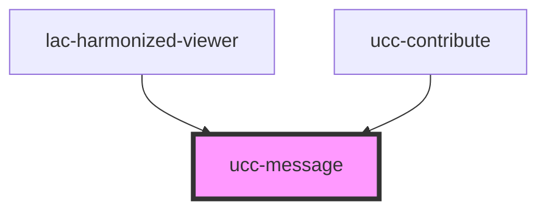

# ucc-message

<!-- Auto Generated Below -->

## Properties

| Property  | Attribute | Description | Type                                                       | Default     |
| --------- | --------- | ----------- | ---------------------------------------------------------- | ----------- |
| `icon`    | `icon`    |             | `string`                                                   | `undefined` |
| `text`    | `text`    |             | `string`                                                   | `undefined` |
| `type`    | `type`    |             | `"default" \| "error" \| "info" \| "success" \| "warning"` | `"default"` |
| `visible` | `visible` |             | `boolean`                                                  | `true`      |

## Dependencies

### Used by

 - [lac-harmonized-viewer](../index-component)
 - [ucc-contribute](../ucc-contribute)

### Graph

----------------------------------------------

*Built with [StencilJS](https://stenciljs.com/)*
