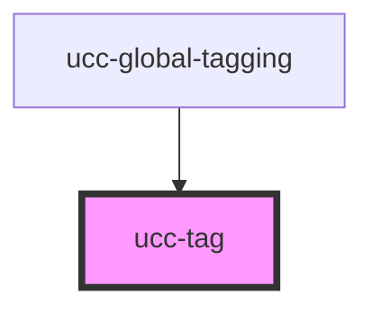

# ucc-tag

<!-- Auto Generated Below -->

## Properties

| Property  | Attribute | Description | Type      | Default     |
| --------- | --------- | ----------- | --------- | ----------- |
| `changed` | `changed` |             | `boolean` | `undefined` |
| `tagId`   | `tag-id`  |             | `number`  | `undefined` |

## Events

| Event    | Description | Type               |
| -------- | ----------- | ------------------ |
| `delete` |             | `CustomEvent<any>` |

## Dependencies

### Used by

 - [ucc-global-tagging](../ucc-global-tagging)

### Graph

----------------------------------------------

*Built with [StencilJS](https://stenciljs.com/)*
