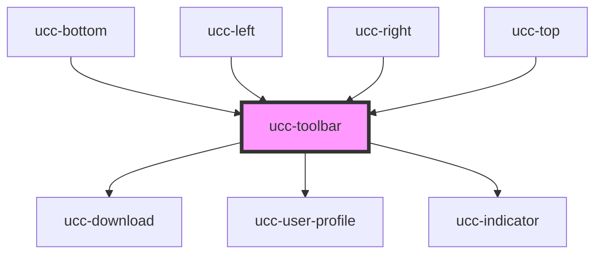

# ucc-toolbar

<!-- Auto Generated Below -->

## Properties

| Property               | Attribute                | Description | Type      | Default                                         |
| ---------------------- | ------------------------ | ----------- | --------- | ----------------------------------------------- |
| `hideContributeButton` | `hide-contribute-button` |             | `boolean` | `false`                                         |
| `isUcc`                | `is-ucc`                 |             | `boolean` | `false`                                         |
| `itemNumber`           | `item-number`            |             | `string`  | `undefined`                                     |
| `items`                | --                       |             | `Item[]`  | `undefined`                                     |
| `language`             | `language`               |             | `string`  | `document.querySelector('html').lang \|\| 'en'` |
| `manifestLoaded`       | `manifest-loaded`        |             | `boolean` | `false`                                         |
| `referenceSystem`      | `reference-system`       |             | `string`  | `undefined`                                     |

## Events

| Event                     | Description | Type               |
| ------------------------- | ----------- | ------------------ |
| `_lacModFullscreenToggle` |             | `CustomEvent<any>` |

## Dependencies

### Used by

 - [ucc-bottom](../ucc)
 - [ucc-left](../ucc)
 - [ucc-right](../ucc)
 - [ucc-top](../ucc)

### Depends on

- [ucc-download](../download)
- [ucc-user-profile](../ucc-user-profile)
- [ucc-indicator](../ucc/ucc-indicator)

### Graph

----------------------------------------------

*Built with [StencilJS](https://stenciljs.com/)*
