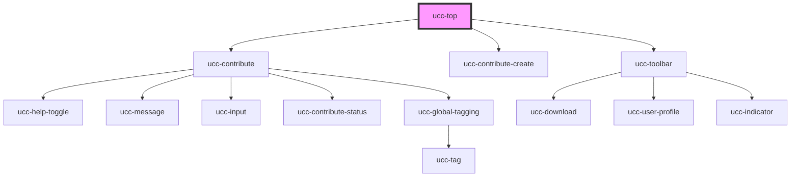

# ucc-top

<!-- Auto Generated Below -->

## Properties

| Property                      | Attribute                        | Description | Type      | Default     |
| ----------------------------- | -------------------------------- | ----------- | --------- | ----------- |
| `contributionDrawerForceOpen` | `contribution-drawer-force-open` |             | `boolean` | `undefined` |
| `ecopy`                       | `ecopy`                          |             | `string`  | `undefined` |
| `enabled`                     | `enabled`                        |             | `boolean` | `undefined` |
| `fetched`                     | `fetched`                        |             | `boolean` | `undefined` |
| `fetching`                    | `fetching`                       |             | `boolean` | `undefined` |
| `haserror`                    | `haserror`                       |             | `boolean` | `undefined` |
| `isDrawerOpen`                | `is-drawer-open`                 |             | `boolean` | `undefined` |
| `isFullscreen`                | `is-fullscreen`                  |             | `boolean` | `undefined` |
| `isUcc`                       | `is-ucc`                         |             | `boolean` | `undefined` |
| `itemNumber`                  | `item-number`                    |             | `string`  | `undefined` |
| `items`                       | `items`                          |             | `any`     | `undefined` |
| `manifestLoaded`              | `manifest-loaded`                |             | `boolean` | `undefined` |
| `referenceSystem`             | `reference-system`               |             | `string`  | `undefined` |

## Dependencies

### Depends on

- [ucc-contribute](../ucc-contribute)
- [ucc-contribute-create](../ucc-create)
- [ucc-toolbar](../ucc-toolbar)

### Graph

----------------------------------------------

*Built with [StencilJS](https://stenciljs.com/)*
