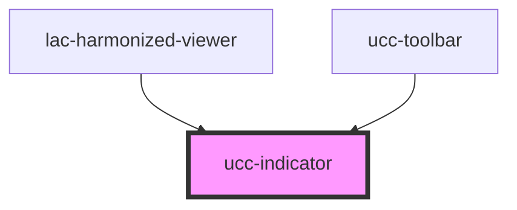

# ucc-indicator

<!-- Auto Generated Below -->

## Dependencies

### Used by

 - [lac-harmonized-viewer](../../index-component)
 - [ucc-toolbar](../../ucc-toolbar)

### Graph

----------------------------------------------

*Built with [StencilJS](https://stenciljs.com/)*
